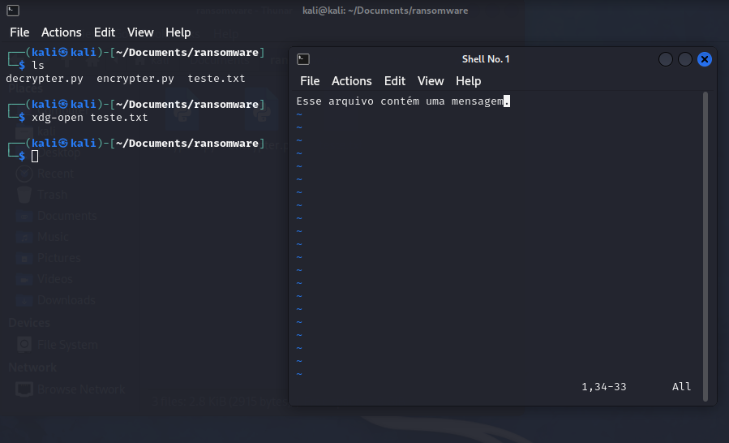
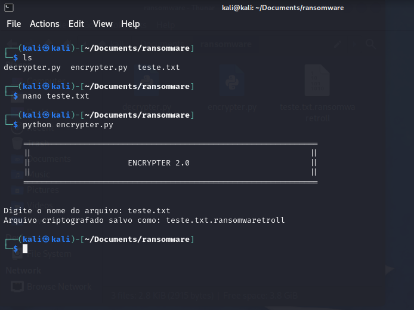
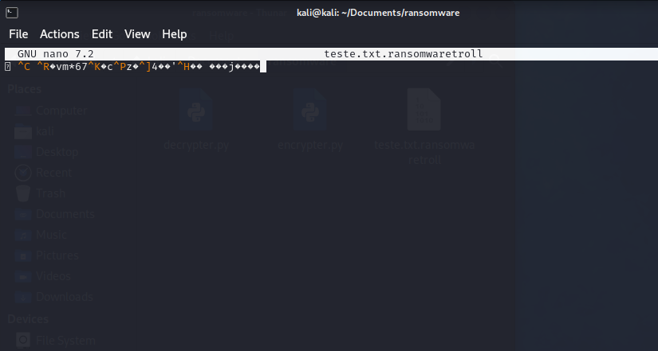
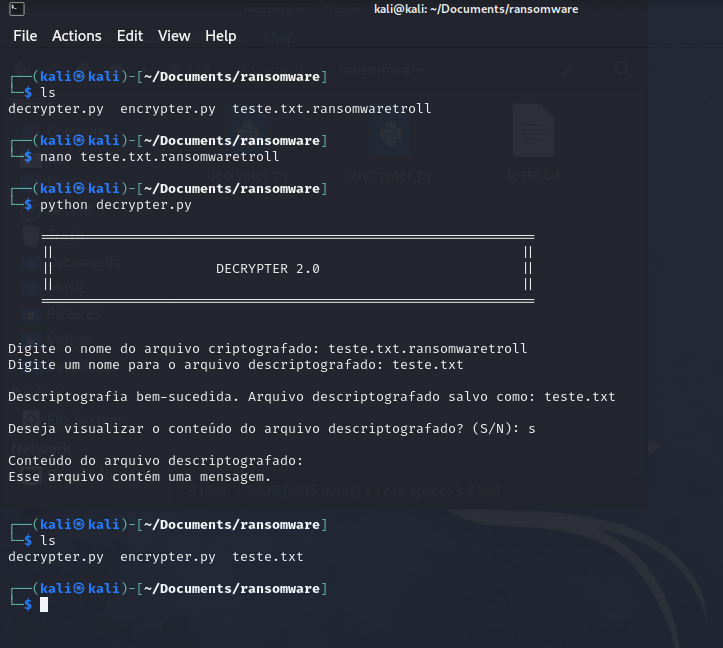

# Desafio Ransomware
Projeto do Santander Bootcamp Cibersegurança

# Instruções
• Neste desafio criamos o código para criptografar e descriptografar um arquivo texto.
• O código "encrypter.py" irá criptografar
• O código "decrypter.py" irá descriptografar

# Resultados
• O conteúdo a ser criptografado

• Criptografando

• Resultado da criptografia

• Descriptografando

# Considerações
- Incrementei no código do encrypter para que fosse possível inserir o nome do arquivo que fosse criptografado
- No código do decrypter é possível colocar o nome do arquivo que será descriptografado, assim como nomear o arquivo que será salvo.
- Ainda no código do decrypter, é possível ler o arquivo para saber se o processo funcionou.

  